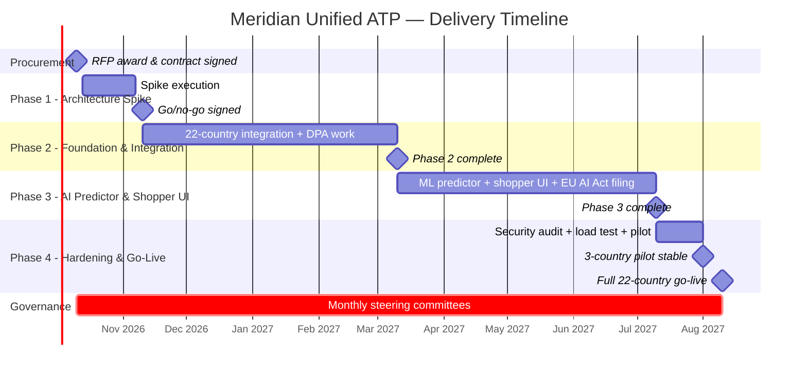

# Milestone Timeline — Meridian ATP System

```mermaid
gantt
    title Meridian Unified ATP — Delivery Timeline
    dateFormat YYYY-MM-DD
    axisFormat %b %Y

    section Procurement
    RFP award & contract signed          :milestone, m0, 2026-10-10, 0d

    section Phase 1 - Architecture Spike
    Spike execution                      :p1, 2026-10-13, 2026-11-07
    Go/no-go signed                      :milestone, m2, 2026-11-10, 0d

    section Phase 2 - Foundation & Integration
    22-country integration + DPA work    :p2, 2026-11-10, 2027-03-10
    Phase 2 complete                     :milestone, m3, 2027-03-10, 0d

    section Phase 3 - AI Predictor & Shopper UI
    ML predictor + shopper UI + EU AI Act filing  :p3, 2027-03-10, 2027-07-10
    Phase 3 complete                     :milestone, m4, 2027-07-10, 0d

    section Phase 4 - Hardening & Go-Live
    Security audit + load test + pilot   :p4a, 2027-07-10, 2027-08-01
    3-country pilot stable               :milestone, m5, 2027-08-01, 0d
    Full 22-country go-live              :milestone, m6, 2027-08-10, 0d

    section Governance
    Monthly steering committees          :crit, gov, 2026-10-10, 2027-08-10
```
