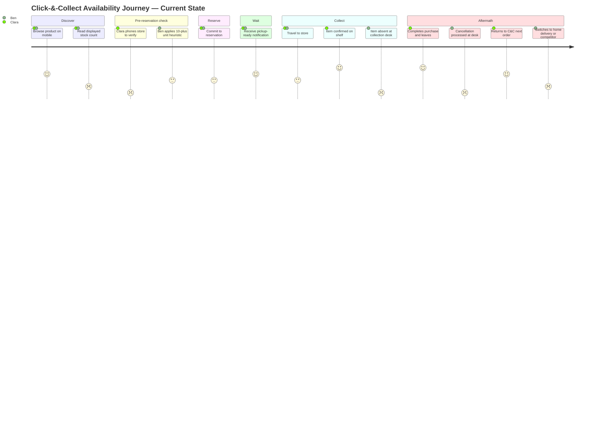

> **Research note:** Web search was unavailable during this kata. Personas and journey scores are based on model training knowledge about omnichannel retail behaviour. Claims marked `[unverified]` below are the highest-priority items to validate with actual user research (interviews, survey data, or published studies) before carrying into stories and acceptance criteria.

## Persona 1 — Clara, The Careful Planner

**Goal:** Reserve a specific item for same-day collection and arrive at the store knowing it will actually be on the shelf.

**Friction:** Clara has been burned by phantom stock twice. She no longer trusts the website's stock count. Her current workaround — phoning the store before every reservation — takes 5–10 minutes and frequently fails (staff can't locate the item quickly, or give a confident answer that later proves wrong).

**Current workaround:** Call the store's front desk before committing. If staff are unavailable or uncertain, she either reserves at two stores simultaneously and cancels the spare, or abandons the reservation and shops with a competitor.

**Behavioural signal:** ≥ 2 past phantom-stock cancellations in order history; average basket ≥ €80; browses on mobile and initiates calls from the product page. High-value customer at risk of channel abandonment due to friction, not dissatisfaction with product range. `[unverified — basket size and call-from-product-page behaviour need validation]`

---

## Persona 2 — Ben, The Time-Poor Opportunist

**Goal:** Use click-&-collect as a lunch-break or commute errand — zero tolerance for a wasted trip; needs a confident answer in under 90 seconds.

**Friction:** No time to phone stores. Self-invented a heuristic: only reserves when the website shows ≥10 units in stock as a proxy for real confidence. Still gets burned during high-demand weekends and paydays when stock evaporates between reservation and collection. Has begun restricting click-&-collect to high-value items where the trip is worth the risk.

**Current workaround:** Personal "10+ units" threshold rule. Reserves and hopes.

**Behavioural signal:** Mobile session under 90 seconds; frequent small-basket orders (€20–40); repeat C&C user with declining frequency over the past six months — a channel-attrition signal masked by average-order metrics. `[unverified — session length, basket size, and frequency-decline pattern need validation against Meridian OMS data]`

---

## Contrast

| Dimension | Clara | Ben |
|---|---|---|
| Risk tolerance | Low — calls to verify | Medium — invented heuristic |
| Time budget | Will invest 10 min per order | < 90 seconds; no calls |
| Failure response | Abandons reservation, shops elsewhere | Cancels, declines C&C frequency |
| Trust signal needed | Replace the phone call | Replace the heuristic |
| Channel-loss type | High-value customer churn | Frequency attrition |

---

## Journey map — current state (no assistant)

**Step scores (1 = worst, 5 = best)**

| Step | Clara | Ben | Note |
|---|---|---|---|
| Browse product page | 4 | 4 | Positive entry; product discovery works |
| Read stock count | 2 | 2 | Shared distrust of displayed number |
| Pre-reservation check | 1 | 3 | Clara's phone call is high friction; Ben's heuristic is low friction but unreliable |
| Commit to reservation | 3 | 3 | Both proceed with residual doubt |
| Pickup-ready notification | 4 | 4 | Positive anticipation; neutral step |
| Travel to store | 3 | 3 | Invested time and effort; anxiety rises |
| Item found / absent | 5 | 1 | Journey diverges; Ben's effort is entirely wasted |
| Aftermath | 4 | 1 | Clara's trust holds; Ben exits the channel |

**Low point:** Ben's collection step (score 1) — the moment the effort investment becomes a total loss. This is the moment the feature must prevent.

---

## Top three unmet needs

**1. A trustworthy pre-reservation signal that replaces the phone call and the heuristic.**
Both personas distrust the raw stock count but cope with it differently. Clara spends 10 minutes on a call that is often inconclusive; Ben invented an unreliable proxy rule. Neither has a fast, reliable answer to the question: *"Will this item actually be on the shelf if I go now?"* The assistant must answer that question directly — no call required, no self-invented rules needed.

**2. An honest "uncertain" state instead of false certainty.**
A binary "in stock / out of stock" is worse than calibrated confidence. Shoppers do not need perfection; they need honesty. An assistant that says "stock is uncertain at this store — 40% chance of miscount" is more trust-building than one that says "in stock" and is wrong. Surfacing uncertainty explicitly allows the shopper to make an informed trade-off rather than being blindsided at the collection desk.

**3. An actionable alternative when the preferred store is doubtful.**
When the assistant cannot confirm availability, it should surface the next-nearest store that can — converting a potential dead end ("you might not find it here") into a completed journey ("collect from Store B, 1.2 km further"). Without this, an Uncertain verdict is just a polished way to lose the sale. The need is not just to inform — it is to give the shopper somewhere to go.
