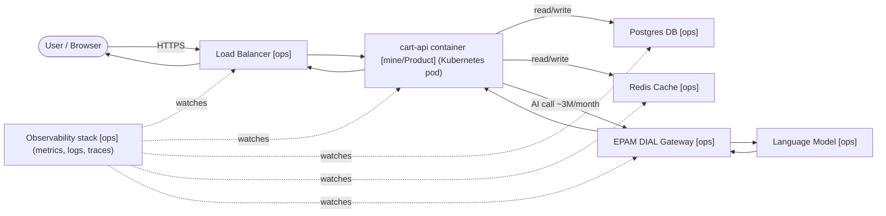

# K 8.W.1 — Stack Map: `cart-api`

**Reference case:** Meridian Retail Group — Case A  
**Service brief:** `cart-api`, a checkout service. Runs as containers on a Kubernetes cluster behind a load balancer; reads and writes a Postgres database; caches in Redis; for the "summarise my cart" step it calls a language model through the company gateway (EPAM DIAL). ~3,000,000 AI calls/month.

---

## Component inventory

| # | Component | What it does | Owner |
|---|---|---|---|
| 1 | **Load Balancer** | Accepts HTTPS requests from clients; routes traffic to healthy pods | [ops] |
| 2 | **Kubernetes Cluster** | Pools compute, schedules container replicas, restarts crashed pods, scales under load | [ops] |
| 3 | **`cart-api` container (pod)** | Runs the checkout business logic — add/remove items, calculate totals, trigger summarise step | [mine/Product] |
| 4 | **Postgres database** | Persists cart state, order records, and customer data | [ops] |
| 5 | **Redis cache** | Caches frequently-read cart data to reduce DB load and latency | [ops] |
| 6 | **EPAM DIAL gateway** | One front door for all AI calls — routes to the language model, attributes cost per team/feature, enforces spend cap, keeps prompt-and-response audit trail | [ops] |
| 7 | **Language model (LLM)** | Generates the natural-language cart summary on demand | [ops] |
| 8 | **Observability stack** (metrics / logs / traces) | Watches all components; fires alerts; surfaces latency, error rate, cost signals | [ops] |

---

## Request flow — Mermaid diagram

---

## Ownership summary

| Tag | Components |
|---|---|
| **[ops]** — platform team owns | Load Balancer, Kubernetes Cluster, Postgres DB, Redis Cache, EPAM DIAL Gateway, Language Model, Observability stack |
| **[mine/Product]** — my team owns | `cart-api` container — its behaviour, business logic, and acceptance bar |

**Key insight:** 7 of 8 components are owned by ops. My team owns one box — what the app *does*, not where it runs. An outage in any of the 7 [ops] components is not mine to fix; it *is* mine to notice and escalate.
